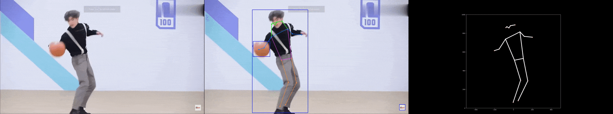

# 💃 2D and 3D Dance Pose Estimation 

- 2D Dance pose Estimation using Yolov7

- 3D Dance pose Estimation using Mediapipe


## Abstract
This project detect the 2D and 3D dance pose data using Yolov7 and Mediapipe, respectively. A test video has been given in the format of google file id. 
Huamn pose data will be saved in the format of json and will be saved in the output folder.

If need to change another video, delete input folder videos and put new video under input folder. Note could solve multiple videos.

## Getting Started
Clone the repository.

```
git clone https://github.com/Zhijie-He/2D-Dance-Pose-Estimation-with-YOLOv7.git
```

Go to the cloned folder.
```
cd 2D-Dance-Pose-Estimation-with-YOLOv7
```
## Steps to run Code
Create virtual environment
```
### For Linux Users
python3 -m venv yolov7_dance
source yolov7_dance/bin/activate

### For Window Users
python3 -m venv yolov7_dance
cd yolov7_dance
cd Scripts
activate
cd ..
cd ..
```
### Installation
Install requirements with mentioned command below.
```
pip install -r requirements.txt
```

### Object detection and huamn pose estimation
In the configuration file (config/cfg.yaml), a test video has been gived which can be downloaded by gdown. 

Run the code
```
python main.py --device [gpu/cpu] --dim [2D/3D]
```
- device DEVICE  cpu/0,1,2,3(gpu), default gpu
- dim {2D,3D}    choose to extract 2D or 3D huamn pose data, default 3D

The huamn pose estimation data will be saved in output file with the json format.

Plot human pose with json file using matplotlib


## Reference
- https://github.com/WongKinYiu/yolov7
- https://github.com/SkalskiP/sport
- https://github.com/google/mediapipe